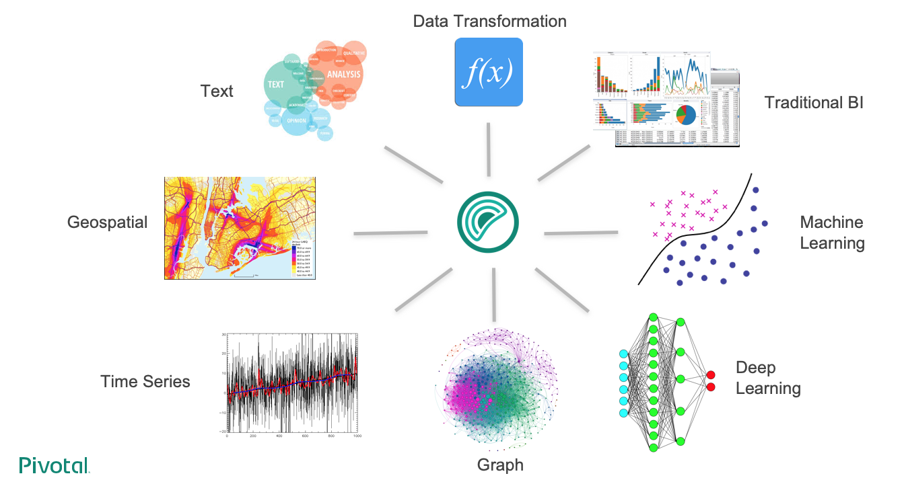

Greenplum offers a unique combination of a powerful, massively parallel processing \(MPP\) database and advanced data analytics. This combination creates an ideal framework for data scientists, data architects and business decision makers to explore artificial intelligence \(AI\), machine learning, deep learning, text analytics, and geospatial analytics.

## The Greenplum Database Integrated Analytics Ecosystem 

The following Greenplum Database analytics extensions are explored in different documentation sections, with installation and usage instructions:

### Machine Learning and Deep Learning 

The [Apache MADlib extension](madlib.html) allows Greenplum Database users to run different machine learning and deep learning functions, including feature engineering, model training, evaluation and scoring.

### Geospatial Analytics 

[PostGIS](postGIS.html) is a spatial database extension for PostgreSQL that allows GIS \(Geographic Information Systems\) objects to be stored in the database. The Greenplum Database PostGIS extension includes support for GiST-based R-Tree spatial indexes and functions for analysis and processing of GIS objects.

### Text Analytics 

[Text Analytics and Search](text.html) enables processing of mass quantities of raw text data \(such as social media feeds or e-mail databases\) into mission-critical information that guides project and business decisions. Tanzu Greenplum Text joins the Greenplum Database massively parallel-processing database server with Apache SolrCloud enterprise search. Tanzu Greenplum Text includes powerful text search as well as support for text analysis.

### Programming Language Extensions 

Greenplum database supports a variety of procedural languages that you can use for programming database analytics. Refer to the linked documentation for installation and usage instructions.

-   [PL/Container](pl_container.html)
-   [PL/Java](pl_java.html)
-   [PL/Perl](pl_perl.html)
-   [PL/pgSQL](pl_sql.html)
-   [PL/Python](pl_python.html)
-   [PL/R](pl_r.html)

## Why Greenplum Database in Integrated Analytics 

The importance of advanced analytics in its various forms is growing rapidly in enterprise computing. Key enterprise data typically resides in relational and document form and it is inefficient to copy data between systems to perform analytical operations. Greenplum is able to run both traditional and advanced analytics workloads in-database. This integrated capability greatly reduces the cost and the silos created by procuring and maintaining multiple tools and libraries.

Greenplum Database advanced analytics can be used to address a wide variety of problems in many verticals including automotive, finance, manufacturing, energy, government, education, telecommunications, on-line and traditional retail.

The Greenplum analytics capabilities allow you to:

-   Analyze a multitude of data types – structured, text, geospatial, and graph – in a single environment, which can scale to petabytes and run algorithms designed for parallelism.
-   Leverage existing SQL knowledge: Pivotal Greenplum can run dozens of statistical, machine learning, and graph methods, via SQL.
-   Train more models in less time by taking advantage of the parallelism in the MPP architecture and in-database analytics.
-   Access the data where it lives, therefore integrate data and analytics in one place. Pivotal Greenplum is infrastructure-agnostic and runs on bare metal, private cloud, and public cloud deployments.
-   Use a multitude of data extensions. Greenplum supports Apache [Kafka integration](https://greenplum.docs.pivotal.io/streaming-server/1-5/intro.html), extensions for HDFS, Hive, and HBase as well as reading/writing data from/to cloud storage, including Amazon S3 objects. Review the capabilities of the Greenplum [Platform Extension Framework \(PXF\)](../admin_guide/external/pxf-overview.html), which provides *connectors* that enable you to access data stored in sources external to your Greenplum Database deployment.
-   Use familiar and leading BI and advanced analytics software that are ODBC/JDBC compatible, or have native integrations, including SAS, IBM Cognos, SAP Analytics Solutions, Qlik, Tableau, Apache Zeppelin, and Jupyter.
-   Run deep learning algorithms using popular frameworks like Keras and TensorFlow in an MPP relational database, with GPU \(Graphical Processing Unit\) acceleration.
-   Use containers capable of isolating executors from the host OS. Greenplum PL/Container implements a trusted language execution engine which permits customized data science workloads or environments created for different end user workloads.
-   Use procedural languages to customize your analytics. Pivotal Greenplum supports development in R, Python, Java, and other standard languages allowing you to distribute execution across the entire cluster to take advantage of the scale and parallelism.

